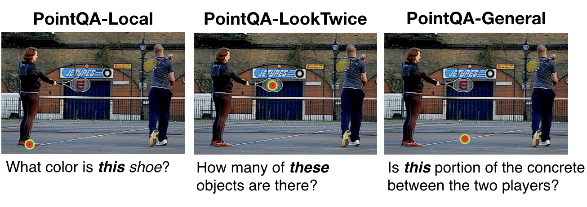

# Point and Ask: Incorporating Pointing into VQA

This is a release of the code for the paper "Point and Ask: Incorporating Pointing Into Visual Question Answering".

<p>
  
</p>

```
@article{mani2020point,
      title={Point and Ask: Incorporating Pointing into Visual Question Answering}, 
      author={Arjun Mani and Nobline Yoo and Will Hinthorn and Olga Russakovsky},
      year={2020},
      eprint={2011.13681},
      archivePrefix={arXiv},
      primaryClass={cs.CV}
}
```
## Requirements

The following packages are required to run the models (datasets already provided):

* Python 3.6
* Pytorch 1.5+
* Pythia v0.3 (MMF v0.4 also acceptable with refactoring)
* vqa-maskrcnn-benchmark
* tensorboardX

## Data

See datasets folder for all datasets: Local-QA, Intent-QA, LookTwice-QA, and Verbal/Spatial Disambiguation. Each dataset is a JSON file (README associated with each dataset describes formatting). Train/val/test image splits are also included for each dataset. Note that the Local-QA and Intent-QA datasets have test-dev sets, which can be used for ablation studies. 

## Models

You can train either the Local-QA-Model or Global-QA-Model on any dataset. For example, to run the Local-QA-Model on the Intent-QA Dataset, run:

```
python3 -W ignore ./tools/run.py --tasks vqa --datasets objpart --model pythia --config configs/vqa/objpart/pythia.yml
```

Config options in pythia.yml should be set according to your needs (can also be modified using command line arguments). Please see the models folder for more details. Also includes details on region/grid feature extraction and the semantic segmentation model for Intent-QA.
