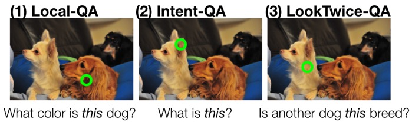
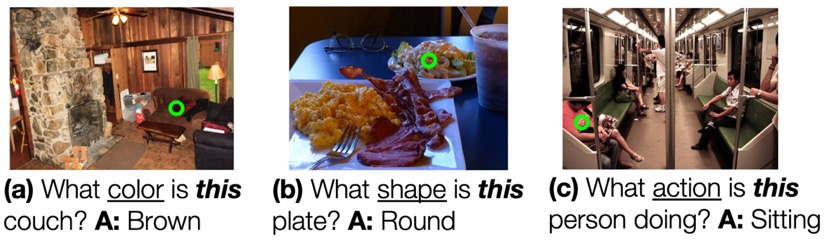

<!-- # Point and Ask: Incorporating Pointing into Visual Question Answering -->
### [Arjun Mani](https://www.linkedin.com/in/arjun-mani/), [William Hinthorn](https://www.linkedin.com/in/williamhinthorn/), Nobline Yoo, [Olga Russakovsky](https://www.cs.princeton.edu/~olgarus/)

## Abstract

Visual Question Answering (VQA) has become one of the key benchmarks of visual recognition progress. Multiple VQA extensions have been explored to better simulate real-world settings: different question formulations, changing training and test distributions, conversational consistency in dialogues, and explanation-based answering. In this work, we further expand this space by considering visual questions that include a spatial point of reference. Pointing is a nearly universal gesture among humans, and real-world VQA is likely to involve a gesture towards the target region. 



## Citation

TODO: Add arxiv information

```
@article{mani2020point,
title={Point and Ask: Incorporating Pointing into Visual Question Answering},
author={Mani, Arjun and Hinthorn, William and Yoo, Nobline and Russakovsky, Olga},
year={2020}
}
```

## Links

- [Paper](#TODO)
- [Code](https://github.com/princetonvisualai/pointingqa)
- [Local-QA Data](#TODO)
- [Intent-QA Data](#TODO)
- [LookTwice-QA Data](#TODO)
- [Local-QA Model](#TODO)
- [Intent-QA Semantic Segmentation Model](#TODO)
- [Intent-QA VQA Model](#TODO)
- [LookTwice-QA Model](#TODO)

## Local-QA

 The first type of questions involves queries about the attributes of a particular object (e.g. "What color is *this* car?"). These questions are local, i.e., a local region around the point is completely sufficient to answer the question. Moreover, it is unnecessary to infer the intended object of reference from the point alone; this is provided by the question. The primary challenge of Local-QA is for the model to accept a point input, which we study in detail. An important challenge is to vary attention around the point depending on the question (consider "What color is this shirt?" and "What action is this person doing?").


 

## Intent-QA 1.0

  We next want to extend Local-QA by requiring the model to explicitly reason about the spatial extent of the point: for example, by asking "what shape is *this*" without having to specify what "this" is referring to beyond the single point. Such questions often appear in real-world settings, where the recipient of the question is expected to infer the intended reference from a pointing gesture. To explicitly test the ability of the model to infer the intended reference, independent of its ability to answer Local-QA questions, we limit Intent-QA to the simple but still surprisingly challenging question "what is *this*?" To further scope this study, we focus on learning whether a human intends to refer to the whole object versus a specific part of the object: consider a point on torso vs. on hand, or the point on the ear of the dog vs on a dog's body in the figure below. We assume that a human pointing to a pixel is referring to either the object or the object part occupying that pixel. This task can be framed either as a VQA or segmentation task and we explore both approaches. Efficiently collecting this dataset poses a number of crowdsourcing challenges.

 

## LookTwice-QA

In the second extension of Local-QA we consider questions that require spatial reasoning beyond the local image region. A natural example is counting questions such as "How many of *this* animal are there?", where the model must identify the relevant object around the point and then use this information to attend to the entire image. These questions require the model to "look twice," first at the point and then at the entire image. The challenge is to perform this two-step compositional reasoning.


